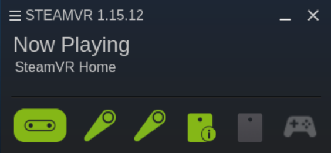
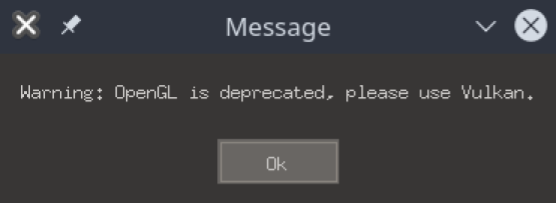

# Running Carla in VR Mode
### Installing Carla 
Follow Carla's own installation guide [here for Linux](https://carla.readthedocs.io/en/latest/build_linux/) and [here for Windows](https://carla.readthedocs.io/en/latest/build_windows/). This will also provide the information to install (or build if using Linux) Unreal Engine 4.24 which is required to build Carla.

#### Error handling for some Linux installations
  
If you are getting a `NotImplementedError` when building the `PythonAPI` this is likely due to the limited distributions that Carla *officially* supports. Your distro is likely not one of {`ubuntu`, `debian`, `deepin`} so you'll need to add your distribution's name to the list within the python source. This can be found in `carla/PythonAPI/carla/setup.py` on line 38 as:
```python
if linux_distro.lower() in ["ubuntu", "debian", "deepin"]:
```
To get the name of your distribution (in the correct format) do the following:
```python
# python3
>>> import distro
>>> distro.linux_distribution()[0].lower()
'pop!_os'
```
and add the output to the list above, for example:
```python
if linux_distro.lower() in ["ubuntu", "debian", "deepin", "pop!_os"]:
```
Assuming everything was done correctly you should be able to rebuild with no problems.
For further information, here's the [issue on Github](https://github.com/carla-simulator/carla/issues/1436).

## Setting up Carla for VR mode

Assuming Carla is installed and runnable (you can test this with `make launch`) we can begin the process for configuring Carla to work in VR! 

### Windows users can skip *section III* below, as it is for configuring the `opengl` mode for Linux rendering

### I. Prerequisites
We'll need [SteamVR](https://store.steampowered.com/app/250820/SteamVR/) to be installed and working with your VR headset. For both Linux & Windows this application should be installable through the native [Steam](https://store.steampowered.com/about/) application.

For the remainder of my guides I used a [HTC Vive Pro Eye](https://enterprise.vive.com/us/product/vive-pro-eye-office/) headset with [Valve's lighthouse trackers](https://www.valvesoftware.com/en/index/base-stations). Note that for this study we only need one tracker since this is primarily a seated VR experience and we won't be needing all 360&deg; of motion. 

This setup makes my SteamVR overlay look like this:



Additionally, note that for the best experience in this driving simulator we will be using the **Standing Only** environment setup for the SteamVR play area. This should be calibrated each time by right clicking the pop-up indicator from above and selecting `"Run Room Setup"` for the standing-only mode you'll need calibrate two main features:
1. Place the headset in the forward-facing direction of your posture, this will define the default forward orientation.
2. Place the headset on a stable surface off the ground and measure its relative position from the ground to get a sense of scale. 

With the SteamVR seated mode we should be ready to go to the next step.

### II. UE4 SteamVR plugin
In order for SteamVR to communicate with Unreal Engine, we'll need to use Valve's [SteamVR plugins](https://github.com/ValveSoftware/steamvr_unreal_plugin). 
- On Linux download the latest version (as of writing this guide is for UE4.23) and place the unzipped folder in `carla/Unreal/CarlaUE4/Plugins/` as explained in the [section I of Valve's README](https://github.com/ValveSoftware/steamvr_unreal_plugin#i-how-to-add-this-plugin-to-your-ue4-project)
- On Windows you can install SteamVR from within the [UE4 Marketplace](https://www.unrealengine.com/marketplace/en-US/product/steamvr-input-for-unreal), again the latest version is advised.

As mentioned before, the current latest available version of SteamVR is for UE4.23 but our installation is for UE4.24. This is fine and will still function for our purposes, we'll simply have a skippable warning upon launching the editor. It will look something like this, just click `Yes`


### III. Configuring `opengl` rendering
**Note this is not required if you're on Windows. The Windows version of Carla/UE4 works with Vulkan*

Here's some information provided by Carla on [Vulkan vs OpenGL rendering options](https://carla.readthedocs.io/en/latest/adv_rendering_options/)

In the *Release* version of Carla, they provide an executable `CarlaUE4.sh` which can toggle `opengl` mode with a simple flag `./CarlaUE4.sh -opengl`.

However, since we want to build Carla from source we'll need do the following:
1. In `carla/Util/BuildTools/BuildCarlaUE4.sh` on line 29 we'll want to change `RHI="-vulkan"` to `RHI="-opengl"` to default to `opengl` mode. [Source](https://github.com/carla-simulator/carla/issues/2063)
   1. You should be able `make launch` now and the `opengl` mode should be applied by default
      1. If you are getting a `Trying to force OpenGL RHI but the project does not have it in TargetedRHIs list.` error then you should look at this [guide](https://rhycesmith.com/2020/06/12/enable-opengl-and-disable-vulkan-in-unreal-engine-4-25/) to reenable OpenGL. 
2. You should now be able to simply `make launch` and have a working OpenGL backend renderer. There may be additional shader/texture compilation required after booting into the editor for the first time. 

Also note that since `openGL` is technically deprecated you'll get another harmless warning when launching the editor, again you can just click `Ok`: 



With all the installations done, we can move on to actually using Carla+UE4 with VR mode. These are the instructions to run it from scratch.

1. Plug in VR headset to your computer. 
   1. Make sure the headset is supported by UE4 (Officially supported: Oculus Rift, Samsung Gear VR, HTC Vive, PSVR, Google VR, Windows Mixed Reality, etc.). More info can be found in the [UE4 documentation](https://www.unrealengine.com/en-US/vr).
2. Start SteamVR and make sure the headset is detected and active
3. After running `make launch` and loading the editor, you should be able to see this dropdown menu: 
   
| Dropdown Menu | Resulting Play Button |
| --- | --- |
| <center>  </center> | <center>  </center> |

1. From here we can compile a binary of Carla with VR support. To do so, run `make package` and locate the resulting executable in: 
   1. Linux: `carla/Dist/CARLA_Shipping_0.9.11-dirty/LinuxNoEditor/CarlaUE4.sh`
   2. Windows: `carla/Build/Unreal/CARLA_Shipping_0.9.11-dirty/WindowsNoEditor/CarlaUE4.exe`
2. Then run the binary with VR mode enabled with `-vr` flags:
   1. Linux: `./CarlaUE4.sh -vr` (from any terminal)
   2. Windows: `CarlaUE4.exe -vr` (from the `x64 Visual C++ Toolset` command prompt)

## Other Tips
### Performance
Note that in some cases the VR mode under Linux and OpenGL takes a big performance hit and may have poor frametimes even with powerful GPU's.

To get a much smoother experience you can run Carla with the flag `-quality-level=Low` instead of the default `-quality-level=Epic`. More information can be found in the [Carla Rendering Documentation](https://carla.readthedocs.io/en/latest/adv_rendering_options/).

For our later purposes, we'd want to keep the **full rendering distance** which is provided in the `Epic` quality but not `Low`. But for improved performance we may want to tone down the graphical fidelity like `Low`, so we'll need to modify some source code and recompile the project. 

You can modify the `C++` file at `carla/Unreal/CarlaUE4/Plugins/Carla/Source/Carla/Settings/CarlaSettingsDelegate.cpp` on line 99 with:
```c++
case EQualityLevel::Low:
{
   // execute tweaks for quality
   LaunchLowQualityCommands(InWorld);
   // iterate all directional lights, deactivate shadows
   SetAllLights(InWorld, CarlaSettings->LowLightFadeDistance, false, true);
   // Set all the roads the low quality materials
   SetAllRoads(InWorld, CarlaSettings->LowRoadPieceMeshMaxDrawDistance, CarlaSettings->LowRoadMaterials);
   // Set all actors with static meshes a max disntace configured in the
   // global settings for the low quality
   SetAllActorsDrawDistance(InWorld, CarlaSettings->LowStaticMeshMaxDrawDistance);
   // Disable all post process volumes
   SetPostProcessEffectsEnabled(InWorld, false);
   break;
}
```
Simply change the `SetAllActorsDrawDistance` to match the case for `Epic` quality:
```c++
   // Set all actors with static meshes a max disntace configured in the
   // global settings for the low quality
   SetAllActorsDrawDistance(InWorld, 0); // Full render distance
```
Now, recompiling the project with `make package` will have a `Low` quality preset with full rendering distance.
### Starting with a `Conda` environment
To begin working with the `PythonAPI` in a `Carla` based Anaconda environment you can follow [this guide](https://github.com/carla-simulator/carla/issues/1054) to create the environment. If doing work with the `python` clients it is advisable to use a `Conda` environment. This is especially useful for avoiding the `ModuleNotFoundError: No module named 'carla'` errors that occur when you're missing `Carla` python.
```properties
# in /PATH/TO/carla/
conda create --name carla_env python=3.5
conda activate carla_env
```