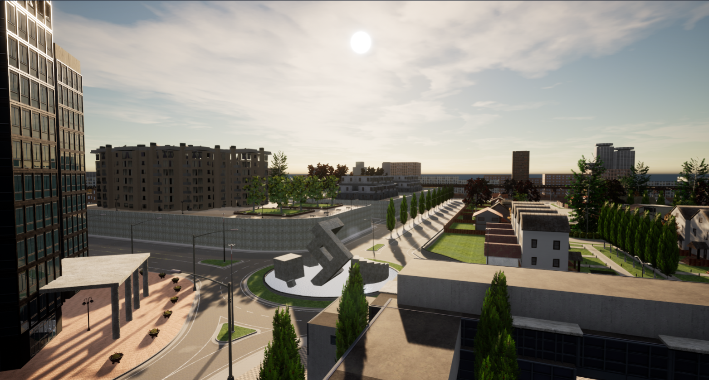
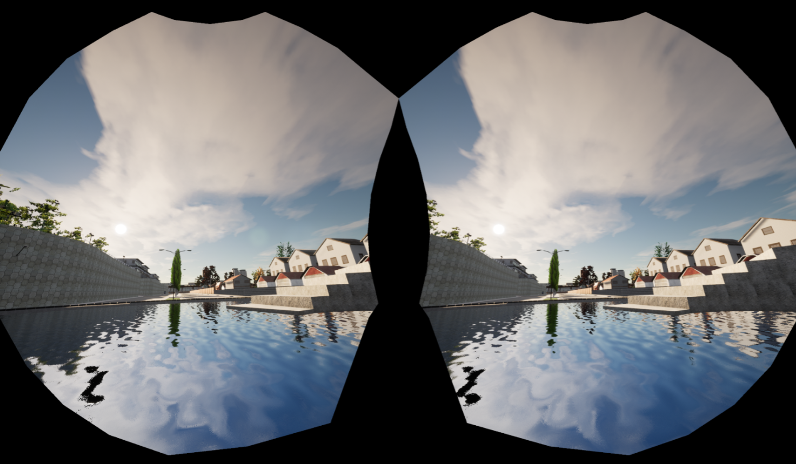
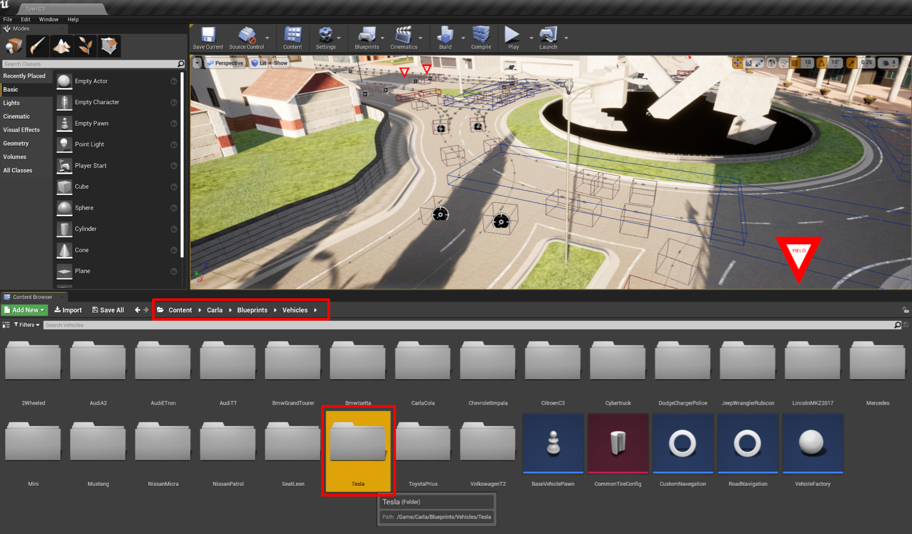
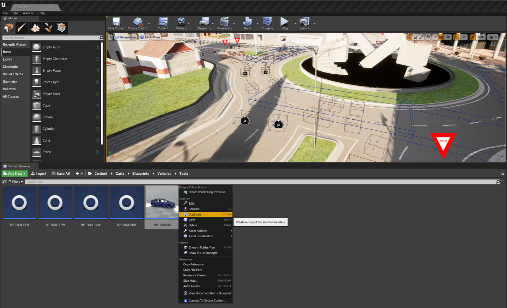
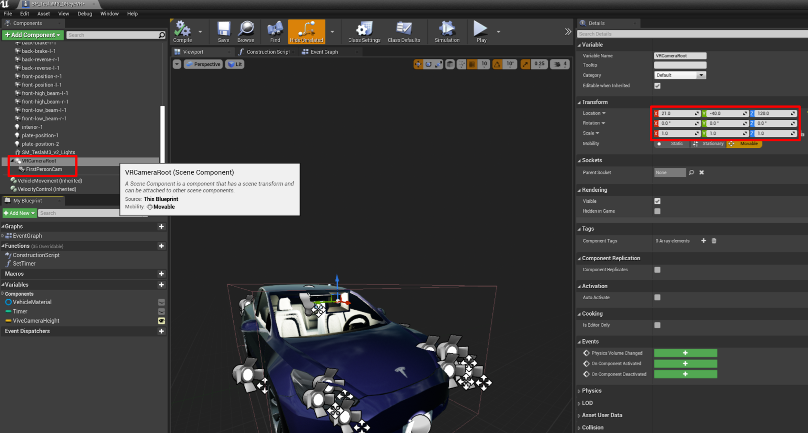
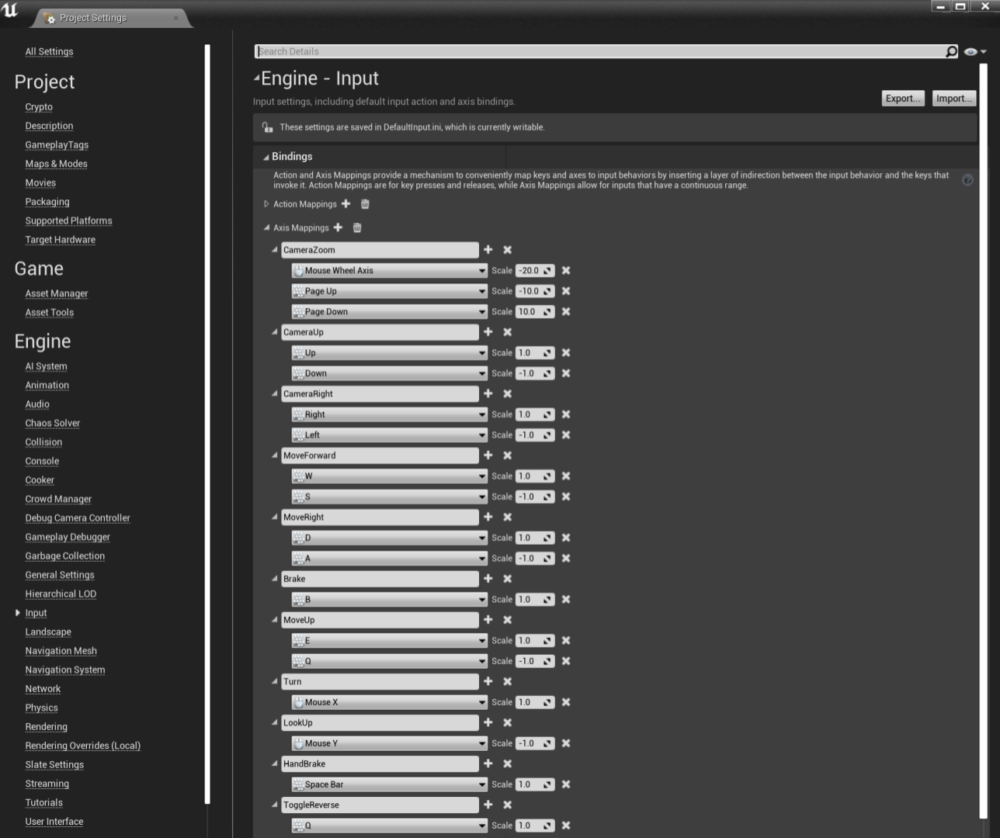
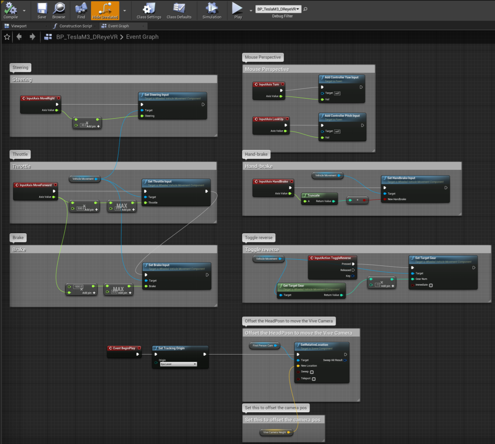
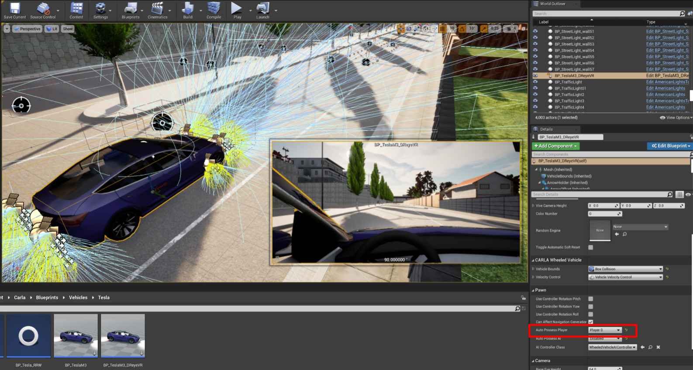
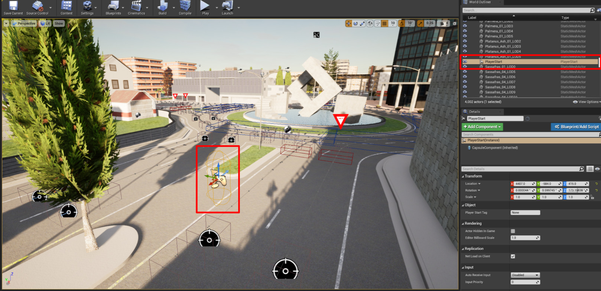

# Configuring a drivable VR player

### Prerequisites
We'll need the **VR-mode** to be installed and fully functional, see [VR-mode.md](VR-mode.md)

The default client server (simulator) spawns you in as a `Spectator`. This means you default in a no-clip mode controllable with `WASD`+`Mouse`.
#### The default no-clip spectator mode

Additionaly, when running this server in `-vr` mode, we spawn in a default center with no motion controls, only camera movement:
#### The default VR spectator mode

This is fine if only using an external client. However, since we want a VR controllable player and the server (UE4) supports VR we'll need to spawn a player within the server.

## Creating our own player in the Simulator
First off, in order to have create our own drivable vehicle within a VR instance of the Carla simulator, we'll need to select a vehicle to drive.

### I. Locating the vehicle model
Carla provides the blueprints for a wide variety of vehicle actors under `Content/Carla/Blueprints/Vehicles`. For our purposes we used a **Tesla Model 3** vehicle but this guide should work for any blueprints.

### II. Create a new vehicle blueprint
The simplest option is to duplicate the existing vehicle blueprint you want to use and rename it. For this guide we renamed the car to `BP_TeslaM3_DReyeVR`

### III. Add a First-Person Camera & VR root
We'll first need to double click on the new `BP_TeslaM3_DReyeVR` file that was created in the previous section, this will open a new blueprint window as shown below. The default behaviour is to open the window in the `Event Graph` view, but we'll be working in the `Viewport` section for now.
1. We'll first want to click the green `+Add Component` button for a `Scene` component that is attached (child of) the main skeletal mesh component.
   1. You can name this component whatever you'd like, we'll name it to `"VRCameraRoot"` for clarity. We won't need to reference this component later
2. Here you can drag and drop this `VRCameraRoot` component around the vehicle model. Since we want it to be in the place of a driver's seat, we'll place it at `X:21.0, Y:-40, Z:120` relative to the vehicle. 
3. We'll then need to create a camera component and attach it to the `VRCameraRoot`. You can also name this component whatever you'd like but note that we'll need to reference this item later. We named ours `"FirstPersonCam"`. 
   1. Note that by attaching this component to the `VRCameraRoot` the camera inherits its position, so you don't need to change the camera's transform (leave it at {0, 0, 0}).
   2. Additionally, to have the camera's relative position locked to the vehicle instead of the world (absolute) it is important that you ensure the `Camera Options > Use Pawn Control Rotation` is **unchecked**. This will prevent mouse controls for the time being but will be perfect for our VR requirements. 
      1. If you decide to check this box then the mouse will be able to control the camera position both in the VR-mode as well as 2D mode. However, in VR mode driving the car in any direction will not propogate to the camera, thus you'd need to turn your head in the real world to match the vehicle which is not a great experience. 
   

### IV. Add control inputs to the world
Now with a camera attached to the actor we'll need to have some way to control the vehicle while in VR (or non-VR) mode from the simulator.

If we head back to the main editor window and click on `Settings > Project Settings` we'll open a new `Project Settings` window where we can add custom input events.

On the left head to `Input > Bindings` which will look like the screenshot below. You can then add axis mappings similar to ours which simply add Keyboard + Mouse input to our world. 

For our simple vehicle controls we are going to use the following keybindings:
- `W` : Throttle/accelerate
- `A` : Turn left
- `S` or `B` : Brake
- `D` : Turn right
- `Q` : Toggle reverse
- `Space` : Hold for handbrake

***Note some controls have negative scale.**

For example, leaving `Mouse Y` to `+1` then this leads to inverted mouse viewing controls.

### V. Write the control scheme in the event graph
In order for UE4 to take these inputs and actually use them, we'll need to specify what inputs correspond to what actions. This can be done with the `Event Graph` from the blueprint window. 

Note that to create blocks you can simply right click in the window and search for the block. Going in order for the important mechanics of our control scheme we have:

1. **Mouse Perspective** - We'll want to use the `Turn` input (`Mouse X`) for the `ControllerYawInput` and the `Lookup` input (`Mouse Y`) for the `ControllerPitchInput` to have proper mouse movement.
2. **VR Perspective** - We'll want to use the `Tracking Origin` of the headset in `Eye Level` mode (seated position) as the event to trigger `SetRelativeLocation`. This is locked to the `FirstPersonCam` from before (See section III) and can be offset by a `Camera Height` vector (In our case the vector is {0, 0, 0} so it is unnecessary).
3. **Steering** - We can handle this with `MoveRight` which is scaled by 30 and sent to the `SetSteeringInput` since `A` is negative this moves left while `D` moves right. 
4. **Throttle** - We first scale the output of `MoveForward` by 500 and clamp by [0, +$\infty$) to only use `W` for forward acceleration.
5. **Brake** - We'll take the same output from `MoveForward` but scale by -500 (reverse it) and clamp by [0, +$\infty$) to use `S` for the brake value.
6. **Toggle Reverse** - We'll want to use an `InputAction` for `ToggleReverse` rather than an `InputAxis` where the `Pressed` action calls `SetTargetGear` which flips between normal and reversed.
7. **(Opt.) Hand Brake** - We can simply take the `HandBrake` input (`Space`) and pass that into the `SetHandbrakeInput`. This is unnecessary and only for example's sake since we already have a brake mechanism

By the end your event graph should look something like this:

### VI. Place the actor in the scene and use it
Finally, the actor should be finally complete and drivable, the last thing to do is insert our new `BP_TeslaM3_DReyeVR` blueprint into the scene. You can do this by simply dragging and dropping the blueprint onto the map.

Once the actor is placed in the environment and can be selected, you should be able to see the camera perspective which should be in the driver's seat!

The next step is to enter the `Details` window on the right and search for `Auto Possess Player`. Change this from `Disabled` to `Player 0` so that the `Spectator` spawns directly into the driver's seat as desired.

Screenshot for reference:

***Important: Remove old spawnpoint**: Finally, the last step is to remove the existing `SpawnPlayer` component in the Map. For example in the default `Town03` map Carla defaults the player position here.
- By deleting this spawnpoint the server will default the player in the `BP_TeslaM3_DReyeVR` blueprint.

From here you should now have a fully functional player/spectator within a VR Carla Driving simulator!